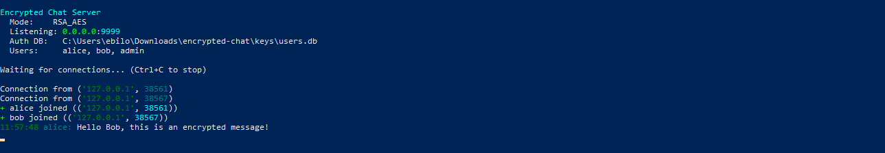
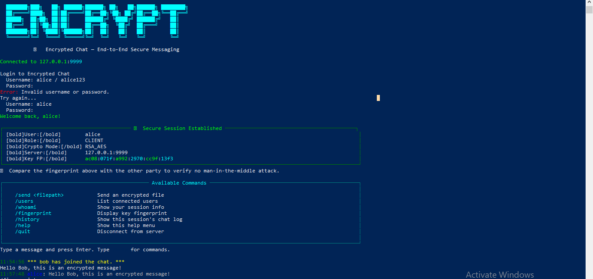
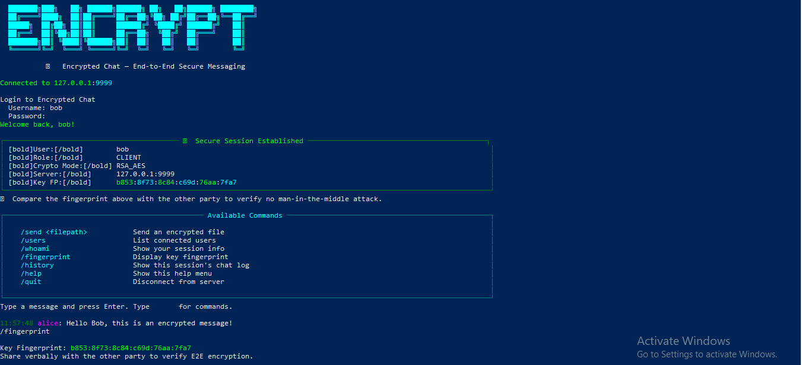

# Encrypted Chat Application


A production-grade end-to-end encrypted terminal chat application demonstrating RSA-2048 key exchange, AES-256-GCM message encryption, bcrypt authentication, and encrypted file transfer over raw TCP sockets.

## Screenshots







## Features

- RSA-2048 + AES-256-GCM hybrid encryption
- bcrypt password authentication
- Encrypted file transfer with SHA-256 verification
- SSH-style key fingerprints for MITM detection
- Encrypted chat history logs
- Multi-client server with threading
- Rich colored CLI interface

## Quick Start

**Install dependencies:**
```
pip install -r requirements.txt
```

**Terminal 1 - Start server:**
```
python server.py
```

**Terminal 2 - Connect as Alice:**
```
python client.py
```
Login: alice / alice123

**Terminal 3 - Connect as Bob:**
```
python client.py
```
Login: bob / bob123

## In-Chat Commands

| Command | Description |
|---|---|
| /send filepath | Send an encrypted file |
| /fingerprint | Display key fingerprint |
| /users | List connected users |
| /history | View chat history |
| /quit | Disconnect |

## Author

**Egwu Donatus Achema** - Cybersecurity Student | Python Developer

GitHub: https://github.com/Don-cybertech

LinkedIn: https://linkedin.com/in/egwu-donatus-achema-8a9251378/
